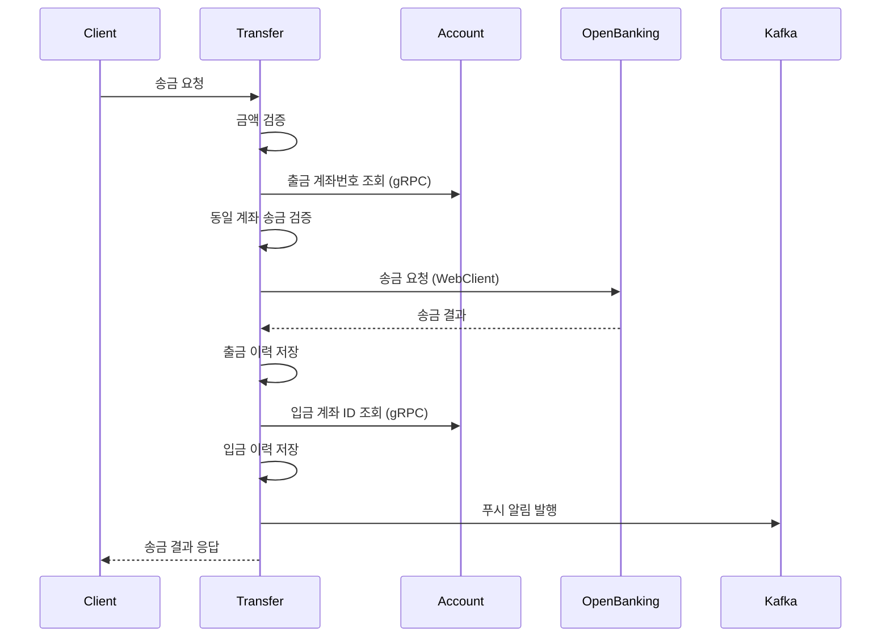
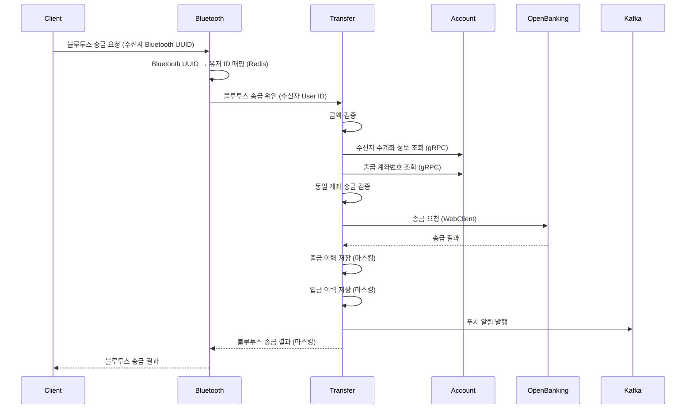
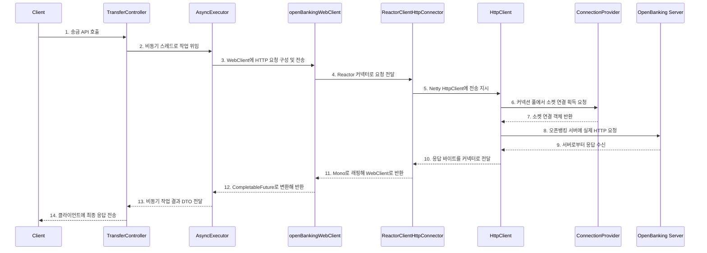

# SSOK Transfer Service

> 송금 처리 및 거래 내역 관리를 담당하는 마이크로서비스

<details>
  <summary><b>[ 📋 개요 ]</b> </summary>

## 📋 개요

SSOK Transfer Service는 SSOK 플랫폼의 **송금 처리 및 거래 내역 관리 시스템**을 담당하는 핵심 서비스입니다. 일반 송금과 블루투스 기반 송금을 처리하며, OpenBanking API와 연동하여 금융 거래를 수행하고, 거래 내역을 관리합니다.

### 주요 기능

- **송금 처리**: 일반 송금 및 블루투스 기반 근거리 송금
- **거래 내역 관리**: 송금 이력 저장, 계좌 별 송금 이력 조회, 최근 송금자 조회
- **OpenBanking 연동**: 외부 금융기관과의 실시간 송금 처리
- **비동기 알림**: Kafka를 통한 실시간 푸시 알림 발송
- **gRPC 통신**: Account Service와의 고성능 계좌 정보 조회

<br/>
</details>

<details>
  <summary><b>[ 🏗️ 아키텍처 ]</b> </summary>

## 🏗️ 주요 아키텍처


<br/>
</details>

<details>
  <summary><b>[ 🔧 기술 스택 ]</b> </summary>

## 🔧 기술 스택

| 분류 | 기술 |
|------|------|
| **Framework** | Spring Boot 3.4.4, Spring Data JPA |
| **Database** | MySQL (주 DB), QueryDSL (복잡 쿼리) |
| **Communication** | REST API, gRPC, OpenFeign, WebClient |
| **Async Processing** | CompletableFuture, @Async |
| **Messaging** | Apache Kafka (알림 발송) |
| **External APIs** | OpenBanking API |
| **Documentation** | OpenAPI 3.0 (Swagger) |
| **Monitoring** | Micrometer, Actuator |
| **Logging** | Slf4j, Logback |
| **Build** | Gradle |

<br/>
</details>

<details>
  <summary><b>[ 📁 프로젝트 구조 ]</b> </summary>

## 📁 프로젝트 구조

```
ssok-transfer-service/
├── src/main/java/kr/ssok/transferservice/
│   ├── client/                    # 외부 서비스 클라이언트
│   │   ├── AccountServiceClient.java    # Account Service Feign
│   │   ├── NotificationServiceClient.java # Notification Service
│   │   └── webclient/
│   │       └── OpenBankingApiClient.java # OpenBanking WebClient
│   ├── config/                    # 설정 클래스
│   │   ├── AsyncConfig.java       # 비동기 처리 설정
│   │   ├── KafkaProducerConfig.java # Kafka 설정
│   │   ├── QueryDSLConfig.java    # QueryDSL 설정
│   │   ├── WebClientConfig.java   # WebClient 설정
│   │   └── SwaggerConfig.java     # API 문서 설정
│   ├── controller/                # REST API 컨트롤러
│   │   ├── TransferController.java       # 송금 처리 API
│   │   └── TransferHistoryController.java # 거래 내역 API
│   ├── dto/                       # 데이터 전송 객체
│   │   ├── request/               # 요청 DTO
│   │   │   ├── TransferRequestDto.java
│   │   │   ├── BluetoothTransferRequestDto.java
│   │   │   └── TransferBluetoothRequestDto.java
│   │   └── response/              # 응답 DTO
│   │       ├── TransferResponseDto.java
│   │       ├── TransferHistoryResponseDto.java
│   │       └── TransferCounterpartResponseDto.java
│   ├── entity/                    # JPA 엔티티
│   │   └── TransferHistory.java   # 송금 이력 엔티티
│   ├── enums/                     # 열거형
│   │   ├── TransferType.java      # 입금/출금 구분
│   │   ├── TransferMethod.java    # 일반/블루투스 구분
│   │   ├── BankCode.java          # 은행 코드
│   │   └── CurrencyCode.java      # 통화 코드
│   ├── exception/                 # 예외 처리
│   │   ├── TransferException.java
│   │   ├── TransferExceptionHandler.java
│   │   └── TransferResponseStatus.java
│   ├── grpc/                      # gRPC 클라이언트
│   │   └── client/
│   │       └── AccountServiceClient.java
│   ├── kafka/                     # Kafka 관련
│   │   ├── producer/
│   │   │   └── NotificationProducer.java
│   │   └── message/
│   │       └── KafkaNotificationMessageDto.java
│   ├── repository/                # 데이터 접근 계층
│   │   ├── TransferHistoryRepository.java
│   │   └── custom/                # QueryDSL 커스텀 리포지토리
│   │       └── impl/
│   │           └── TransferHistoryRepositoryImpl.java
│   ├── service/                   # 비즈니스 로직
│   │   ├── TransferService.java
│   │   ├── TransferHistoryService.java
│   │   └── impl/
│   │       ├── TransferServiceImpl.java
│   │       ├── helper/             # 헬퍼 클래스
│   │       │   ├── AccountInfoResolver.java
│   │       │   ├── TransferHistoryRecorder.java
│   │       │   └── TransferNotificationSender.java
│   │       └── validator/
│   │           └── TransferValidator.java
│   └── util/                      # 유틸리티
│       └── MaskingUtils.java      # 민감정보 마스킹
├── src/main/resources/
│   └── logback-spring.xml         # 로깅 설정
├── build.gradle                  # 빌드 설정
└── Dockerfile                    # 컨테이너 이미지 빌드
```

<br/>
</details>

<details>
  <summary><b>[ 🗄️ 데이터베이스 스키마 ]</b> </summary>

## 🗄️ 데이터베이스 스키마

### TransferHistory 테이블
```sql
CREATE TABLE transfer_history (
    id BIGINT AUTO_INCREMENT PRIMARY KEY,
    account_id BIGINT NOT NULL,                    -- 본인 계좌 ID
    counterpart_account VARCHAR(20) NOT NULL,      -- 상대방 계좌번호
    counterpart_name VARCHAR(50) NOT NULL,         -- 상대방 이름
    counterpart_bank_code VARCHAR(20) NOT NULL,    -- 상대방 은행코드
    transfer_type VARCHAR(20) NOT NULL,            -- 입금/출금 (DEPOSIT/WITHDRAWAL)
    transfer_money BIGINT NOT NULL,                -- 송금 금액
    currency_code VARCHAR(10) NOT NULL,            -- 통화 코드 (KRW/USD)
    transfer_method VARCHAR(20) NOT NULL,          -- 송금 방법 (GENERAL/BLUETOOTH)
    created_at TIMESTAMP NOT NULL,                 -- 거래 시간
);
```

### Enum

```java
// 송금 유형
public enum TransferType {
    DEPOSIT,      // 입금
    WITHDRAWAL    // 출금
}

// 송금 방법
public enum TransferMethod {
    GENERAL,      // 일반 송금
    BLUETOOTH     // 블루투스 송금
}

// 통화 코드
public enum CurrencyCode {
    KRW,          // 한국원
    USD           // 미국달러
}
```

<br/>
</details>

<details>
  <summary><b>[ 🔌 API 엔드포인트 ]</b> </summary>

## 🔌 API 엔드포인트

### 송금 처리 (`/api/transfers/openbank`)

| Method | Endpoint | Description | Auth Required |
|--------|----------|-------------|---------------|
| POST | `/` | 일반 송금 | ✅ |
| POST | `/bluetooth` | 블루투스 송금 | ✅ |

### 거래 내역 (`/api/transfers`)

| Method | Endpoint | Description | Auth Required |
|--------|----------|-------------|---------------|
| GET | `/histories?accountId={id}` | 특정 계좌 거래 내역 (3개월) | ✅ |
| GET | `/counterparts` | 최근 송금 상대 목록 | ✅ |
| GET | `/history` | 최근 송금 이력 3건 | ✅ |

<br/>
</details>

<details>
  <summary><b>[ 💼 주요 비즈니스 로직 ]</b> </summary>

## 💼 주요 비즈니스 로직

### 일반 송금 처리 플로우



### 블루투스 송금 처리 플로우



<br/>
</details>

<details>
  <summary><b>[ ⚡ 비동기 처리 및 성능 최적화 ]</b> </summary>

## ⚡ 비동기 처리 및 성능 최적화

### WebClient 도입 배경

기존 SSOK의 송금 로직은 `OpenFeign`을 사용한 **동기 방식**으로 구성되어 있었습니다. 이 방식은 구현이 간단하고 직관적이지만, 외부 오픈뱅킹 서버의 응답 지연이 곧바로 전체 송금 요청의 지연으로 이어지는 **고정적인 Latency** 문제를 초래했습니다.

이는 트래픽이 크게 증가하면 전체 서비스의 응답성에 영향을 주는 병목 지점이 되었고, 사용자가 송금 결과를 빠르게 받아야 하는 모바일 환경에서 **UX 저하**로 이어졌습니다. 또한, Feign은 내부적으로 `Blocking I/O` 기반이기 때문에 호출 대기 중에도 **서버 스레드를 점유**하고 있어, 자원 효율 측면에서도 한계가 있었습니다.

이는 트래픽이 크게 증가하면 
특히 사용자 입장에서는 송금 요청 후 **즉시 결과 응답을 기대**하지만, 모든 처리(예: 알림 포함)가 완료될 때까지 대기해야 하는 구조는 **모바일 환경에서의 빠른 응답성 요구**에 적합하지 않았습니다.

이러한 문제를 해결하기 위해 다음과 같은 이유로 **WebClient 기반 비동기 송금 처리**를 도입하게 되었습니다.

- ✅ **Non-blocking I/O 기반의 네트워크 통신**
  - 대기 시간이 발생해도 서버 스레드를 점유하지 않음
- ✅ **AsyncExecutor와 함께 사용 시 고부하 환경에서도 병렬 처리 효율 확보**

또한, transferService.transfer(...)는 @Async이지만, CompletableFuture 체인이 .thenApply(...)가 완료될 때까지 기다려서 응답을 생성하므로 사용자는 모든 송금 요청에 대한 처리가 끝나고 응답을 받게 됩니다.

즉, 송금에 대한 즉각 응답을 받기 위해 사용자 경험 측면에서 완전한 논블로킹으로 구성하지 않고 클라이언트에게는 **송금 처리 완료 후 응답을 받는 동기 스타일 응답**처럼 동작하도록 했습니다.

> WebClient는 논블로킹 I/O 기반이므로, 외부 서버의 응답을 기다리는 동안에도 스레드 리소스가 블로킹되지 않아 **서버 자원 효율성** 측면에서도 큰 장점을 제공한다고 판단했습니다.

이러한 구조로 전환한 결과, JMeter를 활용한 부하 테스트(동시 100건 요청, 10분간 지속)에서 다음과 같은 성능 개선을 확인할 수 있었습니다.

- 평균 응답 시간: 1172ms → **473ms**
- 처리 속도(TPS): 45.6 → **66.6**

<br/>

### WebClient 기반 송금 처리 시퀀스



<br/>


### WebClient 기반 송금 처리

```java
@Async("customExecutorWebClient")
@Transactional
public CompletableFuture<TransferResponseDto> transfer(Long userId, TransferRequestDto dto, TransferMethod transferMethod) {
    // 1. 송금 금액 검증
    validator.validateTransferAmount(dto.getAmount());

    // 2. 출금 계좌번호 조회
    String sendAccountNumber = accountResolver.findSendAccountNumber(dto.getSendAccountId(), userId);

    // 3. 오픈뱅킹 송금 요청 DTO 생성
    OpenBankingTransferRequestDto obReq = OpenBankingTransferRequestDto.builder()
            .sendAccountNumber(sendAccountNumber)
            .sendBankCode(dto.getSendBankCode())
            .sendName(dto.getSendName())
            .recvAccountNumber(dto.getRecvAccountNumber())
            .recvBankCode(dto.getRecvBankCode())
            .recvName(dto.getRecvName())
            .amount(dto.getAmount())
            .build();

    // 4. WebClient 비동기 호출 및 후속 처리
    return openBankingWebClient
            .sendTransferRequestAsync(obReq)
            .thenApply(response -> {
                if (!response.isSuccess()) {
                    log.error("오픈뱅킹 송금 실패: {}", response.getMessage());
                    throw new TransferException(TransferResponseStatus.REMITTANCE_FAILED);
                }

                // 5. 이력 저장 및 알림
                transferHistoryRecorder.saveTransferHistory(
                        dto.getSendAccountId(), dto.getRecvAccountNumber(), dto.getRecvName(),
                        BankCode.fromIdx(dto.getRecvBankCode()), TransferType.WITHDRAWAL,
                        dto.getAmount(), CurrencyCode.KRW, transferMethod
                );

                saveDepositHistoryIfReceiverExists(sendAccountNumber, dto, transferMethod);

                return TransferResponseDto.builder()
                        .sendAccountId(dto.getSendAccountId())
                        .recvAccountNumber(dto.getRecvAccountNumber())
                        .amount(dto.getAmount())
                        .build();
            });
}
```

### WebClient 비동기 송금 요청

```java
@Override
public CompletableFuture<OpenBankingResponse> sendTransferRequestAsync(OpenBankingTransferRequestDto requestDto) {
    return openBankingWebClient
            .post()
            .uri("/api/openbank/transfers")
            .header("X-API-KEY", apiKey)
            .bodyValue(requestDto)
            .retrieve()
            .bodyToMono(OpenBankingResponse.class)
            .toFuture();
}
```


### Async 설정

```java
@Configuration
@EnableAsync
public class AsyncConfig {

    @Value("${executor.corePoolSizeMultiplier:2}")
    private int coreMul;

    @Value("${executor.maxPoolSizeMultiplier:4}")
    private int maxMul;

    @Bean(name = "customExecutorWebClient")
    public TaskExecutor customExecutorWebClient() {
        ThreadPoolTaskExecutor executor = new ThreadPoolTaskExecutor();
        int cores = Runtime.getRuntime().availableProcessors();
        executor.setCorePoolSize(cores * coreMul);
        executor.setMaxPoolSize(cores * maxMul);
        executor.setQueueCapacity(1000);
        executor.setKeepAliveSeconds(60);
        executor.setThreadNamePrefix("TransferAsync-");
        executor.setRejectedExecutionHandler(new ThreadPoolExecutor.CallerRunsPolicy());
        executor.initialize();
        return executor;
    }
}
```

### WebClient 설정

```java
@Configuration
public class WebClientConfig {

    @Value("${external.openbanking-service.url}")
    private String baseUrl;

    @Bean
    public WebClient openBankingWebClient() {
        ConnectionProvider provider = ConnectionProvider.builder("openbanking-pool")
                .maxConnections(1000)
                .pendingAcquireMaxCount(-1)
                .pendingAcquireTimeout(Duration.ofSeconds(5))
                .build();

        HttpClient httpClient = HttpClient.create(provider)
                .option(ChannelOption.CONNECT_TIMEOUT_MILLIS, 3000)
                .doOnConnected(conn -> conn
                        .addHandlerLast(new ReadTimeoutHandler(3))
                        .addHandlerLast(new WriteTimeoutHandler(3)))
                .responseTimeout(Duration.ofSeconds(3));

        return WebClient.builder()
                .baseUrl(baseUrl)
                .clientConnector(new ReactorClientHttpConnector(httpClient))
                .defaultHeader(HttpHeaders.CONTENT_TYPE, MediaType.APPLICATION_JSON_VALUE)
                .build();
    }
}
```

<br/>
</details>

<details>
  <summary><b>[ 📡 Kafka 메시징 ]</b> </summary>

## 📡 Kafka 메시징

### Kafka 도입 배경

SSOK 시스템의 송금 과정에서 사용자가 즉각적인 송금 응답을 받기 위해서 송금 기능은 필수적인 동기 통신이지만, 알림 전송은 비동기적 처리가 가능합니다. 이전에는 송금 로직이 모두 동기로 구성되어 있어, 오픈뱅킹 요청 및 푸시 알림 요청이 순차적으로 처리되어 전체 Latency를 고정적으로 유발했습니다.

이를 해결하기 위해 **Kafka 기반의 비동기 메시징 구조**를 도입하였습니다.

* **송금 요청 → 오픈뱅킹 처리 → 송금 응답** 은 그대로 동기 처리
* **푸시 알림 전송**은 Kafka Producer가 메시지를 발행하고, Notification 서비스가 Consumer로 메시지를 비동기 수신
* 사용자에게는 **즉시 송금 결과 응답**이 전송되고, 알림은 나중에 도착해도 무관하므로 사용자 경험이 개선됨
* Kafka 도입으로 시스템은 **더 높은 처리량과 확장성**, **서비스 간 결합도 감소**, **오류 발생 시 재처리 및 장애 격리 가능** 이점 확보

> 🔧 참고: 아래 다이어그램은 송금 요청과 알림 전송을 Kafka로 분리하여 Latency를 줄이고, 각 서비스의 책임을 분리한 구조입니다.

#### 기존 로직


#### 개선 로직


<br/>

### 알림 메시지 발행

```java
@Component
public class NotificationProducer {
    public void send(KafkaNotificationMessageDto message) {
        try {
            String jsonMessage = objectMapper.writeValueAsString(message);
            kafkaTemplate.send(topic, jsonMessage);
            log.info("Kafka 알림 메시지 발행: {}", jsonMessage);
        } catch (JsonProcessingException e) {
            log.error("Kafka 메시지 직렬화 실패", e);
        }
    }
}
```

### 알림 메시지 구조

```java
@Builder
public class KafkaNotificationMessageDto {
    private Long userId;                // 수신자 사용자 ID
    private Long accountId;             // 수신자 계좌 ID
    private String senderName;          // 송금자 이름
    private Integer bankCode;           // 은행 코드
    private Long amount;                // 송금 금액
    private TransferType transferType;  // 송금 유형 (입금/출금)
    private LocalDateTime timestamp;    // 발송 시간
}
```

### Kafka 설정

```java
@Configuration
public class KafkaProducerConfig {
    
    @Bean
    public ProducerFactory<String, String> producerFactory() {
        Map<String, Object> props = new HashMap<>();
        props.put(ProducerConfig.BOOTSTRAP_SERVERS_CONFIG, kafkaBootstrapServers);
        props.put(ProducerConfig.KEY_SERIALIZER_CLASS_CONFIG, StringSerializer.class);
        props.put(ProducerConfig.VALUE_SERIALIZER_CLASS_CONFIG, StringSerializer.class);
        props.put(ProducerConfig.ACKS_CONFIG, "all");
        props.put(ProducerConfig.RETRIES_CONFIG, 3);
        props.put(ProducerConfig.ENABLE_IDEMPOTENCE_CONFIG, true);
        return new DefaultKafkaProducerFactory<>(props);
    }
}
```

<br/>
</details>

<details>
  <summary><b>[ 🚀 빌드 및 실행 ]</b> </summary>

## 🚀 빌드 및 실행

### 로컬 개발 환경

1. **사전 요구사항**
   ```bash
   - Java 17+
   - MySQL 8.0+
   - Kafka 2.8+
   - Account Service Running
   - OpenBanking API Server
   ```

2. **의존성 설치 및 빌드**
   ```bash
   ./gradlew clean build
   ```

3. **환경변수 설정**
   ```yaml
    # application.yml
    spring:
      datasource:
        driver-class-name: com.mysql.cj.jdbc.Driver
        url: jdbc:mysql://localhost:3306/ssok-transfer?characterEncoding=UTF-8&serverTimeZone=Asia/Seoul
        username: ${DB_USERNAME}
        password: ${DB_PASSWORD}
        hikari:
          connection-timeout: 30000
    
      jpa:
        hibernate:
          ddl-auto: update
        show-sql: true
    
    kafka:
      bootstrap-servers: ${KAFKA_BOOTSTRAP_SERVERS}
      notification-topic: ${KAFKA_NOTIFICATION_TOPIC}
    
    external:
      openbanking-service:
        base-url: ${OPENBANKING_BASE_URL}
        api-key: ${OPENBANKING_API_KEY}
    
      account-service:
        url: ${ACCOUNT_SERVICE_URL}
      notification-service:
        url: ${NOTIFICATION_SERVICE_URL}
    
    grpc:
      client:
        account-service:
          address: ${ACCOUNT_SERVICE_GRPC_ADDRESS}
   ```

5. **애플리케이션 실행**
   ```bash
   java -jar build/libs/ssok-transfer-service-1.0-SNAPSHOT.jar
   ```

### Docker 컨테이너 실행

1. **이미지 빌드**
   ```bash
   docker build -t ssok-transfer-service:latest .
   ```

2. **컨테이너 실행**
   ```bash
    docker run -p 8081:8081 \
      -e DB_USERNAME=your_db_user \
      -e DB_PASSWORD=your_db_password \
      -e KAFKA_BOOTSTRAP_SERVERS=localhost:9092 \
      -e KAFKA_NOTIFICATION_TOPIC=ssok.notification.topic \
      -e OPENBANKING_BASE_URL=http://localhost:8000 \
      -e OPENBANKING_API_KEY=your_api_key \
      -e ACCOUNT_SERVICE_URL=http://localhost:8091 \
      -e NOTIFICATION_SERVICE_URL=http://localhost:8084 \
      -e ACCOUNT_SERVICE_GRPC_ADDRESS=static://localhost:6565 \
      ssok-transfer-service:latest
   ```

<br/>
</details>

<details>
  <summary><b>[ 🧪 테스트 ]</b> </summary>

## 🧪 테스트

### 테스트 실행
```bash
./gradlew test
```

### API 테스트 (Swagger UI)
```
http://localhost:8080/swagger-ui/index.html
```

### 송금 테스트 예시
```bash
# 일반 송금 테스트
curl -X POST http://localhost:8080/api/transfers/openbank \
  -H "Authorization: Bearer <token>" \
  -H "X-User-Id: 123" \
  -H "Content-Type: application/json" \
  -d '{
    "sendAccountId": 1,
    "sendBankCode": 1,
    "sendName": "홍길동",
    "recvAccountNumber": "1234567890",
    "recvBankCode": 2,
    "recvName": "김철수",
    "amount": 10000
  }'

# 블루투스 송금 테스트(bluetooth-service에서 요청하는 API)
curl -X POST http://localhost:8080/api/transfers/openbank/bluetooth \
  -H "Authorization: Bearer <token>" \
  -H "X-User-Id: 123" \
  -H "Content-Type: application/json" \
  -d '{
    "sendAccountId": 1,
    "sendBankCode": 1,
    "sendName": "홍길동",
    "recvUserId": 456,
    "amount": 5000
  }'
```

<br/>
</details>

<br/>

#### 📞 문의

Transfer Service 관련 문의사항이 있으시면 이슈를 등록해주세요.

---

> **Note**: 이 서비스는 금융 거래를 처리하는 핵심 서비스입니다. 모든 변경사항은 충분한 테스트를 거친 후 적용해야 하며, 장애 발생 시 즉시 대응할 수 있는 모니터링 체계를 갖추고 있습니다. 다른 서비스들과의 연동 정보는 [메인 README](../README.md)를 참조하세요.
